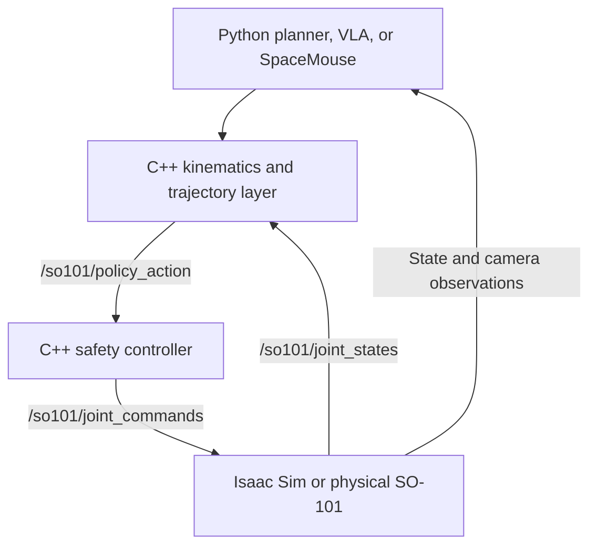

# SO-101 VLA Robotics Project

Simulation-first development environment for an SO-101 follower arm, with a path toward
leader-arm demonstrations, dataset collection, learned policies, and force-adaptive control.

The current system runs the robot in Isaac Sim, bridges joint and camera data to ROS 2, and
uses a safety controller between policies and the simulated robot.
## Architecture


## Current research status

The project supports an end-to-end simulation and learned-policy pipeline:

```text
Isaac Sim camera and joint state
                ↓
          Custom SmallVLA
                ↓
       Predicted joint actions
                ↓
       C++ safety controller
                ↓
        Simulated SO-101 arm
```

Completed components:

- The SO-101 USD loads and runs in Isaac Sim.
- The scene includes a floor, table, lighting, cube, and overhead RGB camera.
- ROS 2 joint-state, joint-command, and camera bridges are working.
- The C++ safety controller validates and forwards policy actions.
- Position, velocity, and effort command interfaces are implemented.
- Position control is the current default and has been tested on all six joints.
- Scripted joint, pose-sequence, and pose-tuning policies are available.
- The reusable C++ serial-chain robot model is implemented.
- Forward and inverse kinematics are implemented.
- The custom PyTorch neural-network primitives and transformer are implemented.
- The `SmallVLA` multimodal action-chunking model is implemented.
- LeRobot dataset adaptation, normalization, and statistics are implemented.
- Training, checkpointing, offline evaluation, and CUDA inference are working.
- The VLA checkpoint is connected to the SO-101 simulation through ROS 2.

The initial checkpoint was trained for ten epochs using a public LeRobot dataset
containing 50 SO-100 follower episodes and 11,939 frames.

Held-out evaluation:

| Metric | Result |
|---|---:|
| Validation samples | 1,193 |
| Mean absolute error | 0.053084 rad |
| Mean absolute error | 3.042 degrees |
| Mean squared error | 0.007896 |
| Maximum error | 1.274848 rad |

The checkpoint produces recognizable pick-and-place-like behavior in the
simulation, confirming that the complete inference pipeline operates. It does
not yet complete the simulated task reliably.

The primary limitation is domain mismatch between the SO-100 demonstration
dataset and the SO-101 Isaac Sim environment. Important differences include
joint calibration, camera viewpoint, object placement, scene appearance, and
the closed-loop states produced by the policy.

Current development priorities are safe inference gating, kinematics
validation, synchronized episode recording, SO-101 simulation demonstrations,
and training on data matched to the target environment.

## Software responsibilities

Python owns:

- Scripted and learned policies
- Dataset processing
- Model training and evaluation
- Checkpoint loading
- VLA inference
- High-level planning

C++ owns:

- Forward and inverse kinematics
- Joint-limit enforcement
- Command validation
- Timeouts and safe-hold behavior
- The time-sensitive robot command path

A joint-space policy publishes targets to:

```text
/so101/policy_action
```

A policy or teleoperation node producing Cartesian targets sends them through
the C++ kinematics layer before reaching the same joint-action interface.

The policy does not need to implement a PID controller. In position and
velocity modes, the Isaac Sim articulation drives perform low-level closed-loop
control. The learned policy produces targets, while the safety controller
validates those targets before forwarding them to the simulator.

Direct effort control is different. It requires appropriate dynamics handling,
suitably configured drive stiffness and damping, gravity compensation, effort
limits, and a higher-rate control loop. It is not the recommended starting
point for the VLA pipeline.

## Project layout

```text
so101-vla-robotics/
├── assets/
│   └── robots/
│       ├── README.md
│       └── so101/
│           ├── so101_new_calib.usd
│           ├── so101_new_calib_base.usd
│           └── so101_new_calib_physics.usd
├── datasets/
│   ├── README.md
│   ├── processed/
│   └── raw/
├── models/
│   ├── checkpoints/
│   └── exported/
├── policies/
│   ├── README.md
│   ├── setup.py
│   ├── tests/
│   └── so101_policies/
│       ├── common/
│       ├── config/
│       ├── data/
│       ├── evaluation/
│       ├── inference/
│       ├── models/
│       │   ├── action/
│       │   ├── language/
│       │   ├── primitives/
│       │   ├── transformer/
│       │   ├── vision/
│       │   └── vla/
│       ├── scripted/
│       ├── training/
│       ├── constants.py
│       └── __init__.py
├── ros2_ws/
│   ├── README.md
│   └── src/
│       ├── common/
│       │   └── robot_kinematics/
│       └── robots/
│           └── so101/
│               ├── so101_bringup/
│               ├── so101_control/
│               └── so101_description/
├── simulation/
│   └── isaac_sim/
│       ├── README.md
│       ├── ros2_camera_bridge.py
│       ├── ros2_joint_bridge.py
│       ├── run_so101_sim.py
│       └── so101_scene.py
└── README.md
```

The following directories are generated locally and excluded from Git:

```text
ros2_ws/build/
ros2_ws/install/
ros2_ws/log/
datasets/raw/*
datasets/processed/*
models/checkpoints/*
models/exported/*
```

## Technical documentation

- [Policy package, training, inference, and CUDA](policies/README.md)
- [Detailed SmallVLA implementation](policies/so101_policies/models/vla/README.md)
- [ROS 2 workspace](ros2_ws/README.md)
- [Isaac Sim integration](simulation/isaac_sim/README.md)

## Robot joints

The controller and policy must use the same joint order.

| Index | Joint | Approximate limit (rad) |
|---:|---|---:|
| 0 | `shoulder_pan` | `[-1.919862, 1.919862]` |
| 1 | `shoulder_lift` | `[-1.745329, 1.745329]` |
| 2 | `elbow_flex` | `[-1.690000, 1.690000]` |
| 3 | `wrist_flex` | `[-1.658063, 1.658063]` |
| 4 | `wrist_roll` | `[-2.743847, 2.841206]` |
| 5 | `gripper` | `[-0.174533, 1.745329]` |

Verify these limits against the final USD and physical calibration before using a real robot.

## Asset selection

Use `so101_new_calib_physics.usd` as the simulation asset. It sublayers the base model and
contains the required physics configuration. The previously generated top-level USD expected
an unavailable sensor layer and is therefore not required for the current setup.

## Python policy setup

From the project root:

```bash
cd "$(git rev-parse --show-toplevel)"
python3 -m pip install --user "setuptools>=70,<80" cffi
python3 -m pip install --user -e ./policies
```

Keeping `setuptools` below version 80 avoids the known conflict with the installed
`colcon-core` version.

## Build the ROS 2 controller

```bash
cd "$(git rev-parse --show-toplevel)/ros2_ws"
source /opt/ros/$ROS_DISTRO/setup.bash
colcon build --packages-select so101_control
source install/setup.bash
```

The C++ source should include the installed-style header path:

```cpp
#include "so101_control/robot_constants.hpp"
```

Do not include a repository-relative path such as
`src/so101_control/include/so101_constants.hpp`.

## Run the system

Use three terminals.

### 1. Start Isaac Sim

```bash
cd "$(git rev-parse --show-toplevel)/simulation/isaac_sim"
/path/to/isaac-sim/python.sh run_so101_sim.py
```

### 2. Start the controller

```bash
source /opt/ros/$ROS_DISTRO/setup.bash
source "$(git rev-parse --show-toplevel)/ros2_ws/install/setup.bash"
ros2 launch so101_control controller.launch.py
```

### 3. Start a policy

```bash
cd "$(git rev-parse --show-toplevel)"
source /opt/ros/$ROS_DISTRO/setup.bash
source ros2_ws/install/setup.bash
python3 -m so101_policies.scripted.joint_test_policy
```

Replace the final module with `pose_sequence_policy` or `pose_tuning_policy` as needed.

## ROS 2 topics

| Topic | Direction relative to simulation | Purpose |
|---|---|---|
| `/so101/joint_states` | Published | Measured joint positions and velocities |
| `/so101/policy_action` | Received by controller | Raw policy or teleoperation target |
| `/so101/joint_commands` | Received | Validated command sent to the robot |
| `/so101/camera/rgb` | Published | RGB observation for recording and VLA input |
| `/so101/camera/camera_info` | Published when supported | Camera intrinsics and metadata |

For Isaac Sim versions where `isaacsim.ros2.bridge` is unavailable, use the compatible
`omni.isaac.ros2_bridge` camera-info import or temporarily omit camera-info publication. RGB
images and synchronized robot state are the immediate requirements for dataset development.

## Control modes

| Mode | Command | Low-level behavior | Recommended use |
|---|---|---|---|
| Position | Joint position | Articulation drive closes the loop | Scripted policies and initial VLA |
| Velocity | Joint velocity | Articulation drive closes the loop | Jogging and selected learned policies |
| Effort | Joint torque/effort | Policy/controller handles dynamics | Later force-control experiments |

Only one primary command mode should control a joint at a time. Position and velocity targets
may be used by different behaviors, but they should not independently compete for the same
joint during one control cycle.

## Leader arm and SpaceMouse workflow

In the physical lab setup, the conventional baseline is leader-to-follower joint mirroring.
The leader arm's motor encoders measure every joint angle; those calibrated angles become the
follower's position targets. The operator thinks in terms of moving the end effector, but the
recorded demonstration contains the complete joint trajectory.

At home, a SpaceMouse can replace the physical leader:

1. Read the current follower joint state from the simulator.
2. Convert SpaceMouse motion into a small desired end-effector displacement.
3. Solve inverse kinematics, seeded with the current joint state.
4. Publish the resulting joint positions to `/so101/policy_action`.
5. Let the existing safety controller validate and forward the command.

The SO-101 arm has five arm degrees of freedom plus the gripper, so it cannot independently
control every component of an arbitrary six-dimensional pose. The IK objective should
prioritize position and use a limited or soft orientation constraint.

Both leader-arm control and SpaceMouse IK should end at the same joint-target interface. This
keeps the controller, simulator, recorder, and learned policy independent of the input device.

## Dataset plan

Each recorded step should contain at least:

- RGB image and timestamp.
- Current joint position and velocity.
- Commanded joint action.
- Episode and task identifiers.
- Success or termination state.

Recommended additional fields are gripper state, end-effector pose computed through forward
kinematics, camera calibration, and control mode. During initial VLA work, use joint-position
actions and treat the Cartesian pose as an auxiliary observation rather than the primary action.

## VLA implementation

The VLA is trained in Python with PyTorch. The repository owns the model-level neural-network
implementation, including linear and embedding layers, normalization, attention, transformer
blocks, multimodal fusion, action decoding, losses, and checkpoint behavior. PyTorch provides
tensors, automatic differentiation, CUDA dispatch, and optimized numerical kernels.

High-level modules such as `torch.nn.Transformer` and `torch.nn.MultiheadAttention` are not used
as the model implementation. Each custom component has reference and optimized execution paths
behind the same interface so correctness can be tested without sacrificing deployment speed.

The initial policy uses offline behavior cloning with joint-position action chunks:

```text
RGB image + language instruction + joint-state history
                         ↓
                custom PyTorch VLA
                         ↓
             future joint-position actions
```

Training and robot operation are separate phases. Isaac Sim is normally closed during full
training runs. At runtime, the trained checkpoint runs under `torch.inference_mode()` and sends
action chunks to the C++ command path. The controller remains responsive if inference is late.

## Next milestones

1. ~~Create the C++ `robot_kinematics` package and SO-101 robot model.~~  
   **Status:** Implemented and building successfully.

2. ~~Implement and validate SO-101 forward kinematics against Isaac Sim.~~  
   **Status:** Implemented; numerical validation against Isaac Sim remains.

3. ~~Implement inverse kinematics with joint limits and continuity constraints.~~  
   **Status:** Implemented; closed-loop validation and tuning remain.

4. Connect SpaceMouse input to the IK target.  
   **Status:** Planned for manual simulation demonstrations.

5. Add synchronized episode recording for images, states, and actions.  
   **Status:** Next major data-pipeline milestone.

6. Collect scripted and teleoperated simulation demonstrations.  
   **Status:** Pending the recorder and reliable scripted task expert.

7. ~~Implement and test the custom transformer components.~~  
   **Status:** Completed. The project includes custom attention, transformer
   blocks, embeddings, normalization, multimodal fusion, and action decoding.

8. ~~Train and evaluate a baseline action-chunking imitation policy.~~  
   **Status:** Completed using a public SO-100 LeRobot dataset. The ten-epoch
   checkpoint achieved a validation MAE of `0.053084 rad` or `3.042 degrees`.

9. ~~Integrate the trained VLA checkpoint with the SO-101 simulation.~~  
   **Status:** Completed. The model receives camera and joint observations,
   performs CUDA inference, and publishes joint actions through ROS 2.

10. Add disabled-by-default policy publishing and controlled single-action
    testing.  
    **Status:** Required before further continuous closed-loop evaluation.

11. Validate SO-100-to-SO-101 joint signs, offsets, limits, and gripper mapping.  
    **Status:** Required because the initial checkpoint was trained using an
    SO-100 follower dataset.

12. Generate an SO-101 dataset directly from the Isaac Sim environment.  
    **Status:** Planned using scripted or IK-based demonstrations followed by
    SpaceMouse teleoperation.

13. Fine-tune the existing checkpoint and train an SO-101 model from scratch.  
    **Status:** Both approaches will be evaluated to measure the value of
    cross-robot transfer.

14. Evaluate closed-loop pick-and-place success under changes in object
    position, camera pose, lighting, and initial robot configuration.

15. Add physical leader/follower calibration and real-robot recording after the
    simulation policy is stable.

16. Introduce force sensing and effort control after position-based VLA behavior
    is reliable.

## Safety notes

- Start with slow trajectories and conservative joint limits.
- Keep policy actions behind the ROS 2 safety controller.
- Reject stale, malformed, non-finite, or incorrectly ordered commands.
- Use command timeouts and a safe hold behavior.
- Keep learned-policy action publishing disabled by default.
- Begin with inference-only testing before sending commands to the robot.
- Execute one bounded action before enabling a complete action chunk.
- Limit commanded changes relative to the latest measured joint state.
- Require recent camera and joint-state observations before inference.
- Validate SO-100-to-SO-101 joint signs, offsets, limits, units, and gripper
  mapping before motion.
- Validate closed-loop behavior in simulation before physical deployment.
- Keep an accessible emergency stop when testing physical hardware.
- Do not enable direct effort control without verified dynamics compensation,
  effort limits, and a suitable high-rate controller.