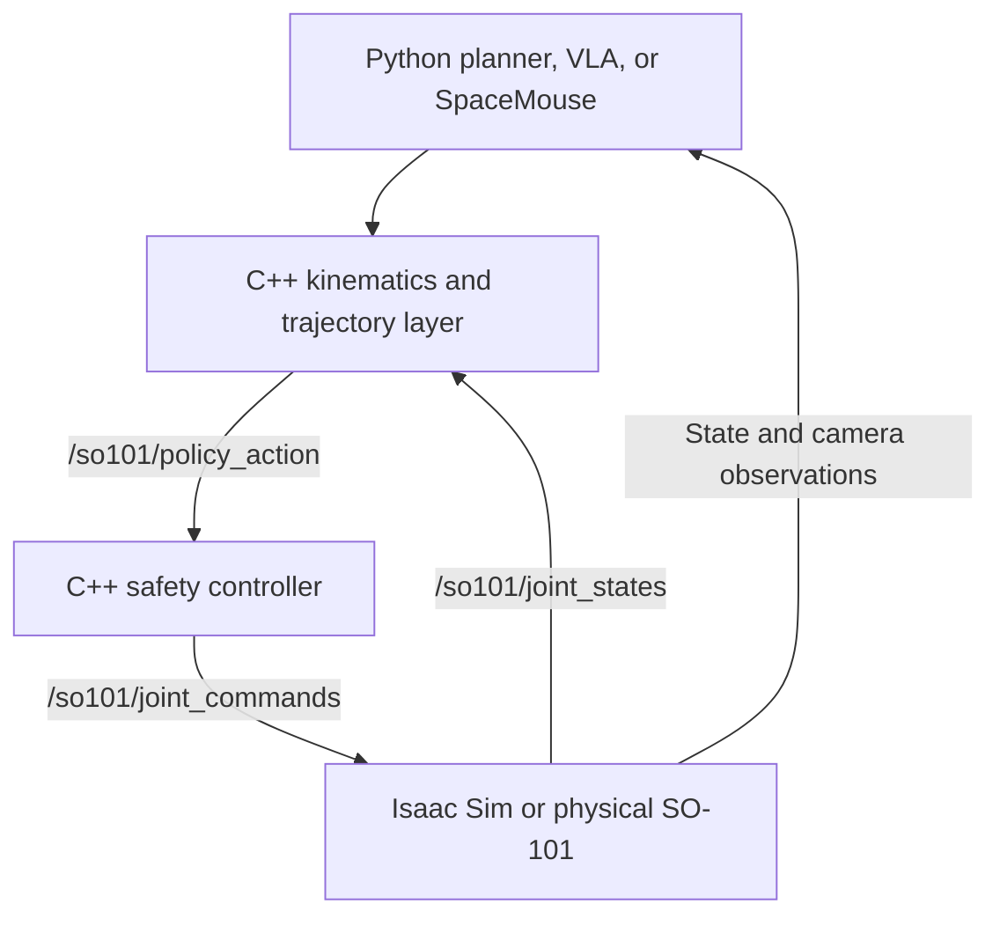

# SO-101 VLA Robotics Project

Simulation-first development environment for an SO-101 follower arm, with a path toward
leader-arm demonstrations, dataset collection, learned policies, and force-adaptive control.

The current system runs the robot in Isaac Sim, bridges joint and camera data to ROS 2, and
uses a safety controller between policies and the simulated robot.

## Current status

- SO-101 USD loads and runs in Isaac Sim.
- Joint state and joint command bridges are working.
- The ROS 2 action safety controller is working.
- Position, velocity, and effort command modes are represented by the controller interface.
- Position control is the current default and has been tested on all six joints.
- Scripted joint, pose-sequence, and pose-tuning policies are available.
- The scene includes a floor, table, lighting, a cube, and an overhead RGB camera.
- The current i9-13900K, RTX 4070, 32 GB DDR5 system is sufficient for initial development.
- Dataset recording, C++ kinematics, SpaceMouse teleoperation, and learned VLA policies are the
  next development stages.

## Architecture



Python owns high-level planning, dataset processing, model training, and VLA inference. C++
owns forward and inverse kinematics, trajectory generation, limits, validation, and the
time-sensitive robot command path.

A policy that predicts joint positions can publish directly to `/so101/policy_action`. A policy
or SpaceMouse node that produces Cartesian targets sends them through the C++ kinematics layer
first.

The policy layer does not need to implement a PID controller. In position and velocity mode,
the articulation drives inside Isaac Sim perform the low-level closed-loop control. A learned
policy should produce targets; the safety controller validates those targets before forwarding
them to the simulator.

Direct effort control is different. It requires appropriate dynamics handling, zero or suitably
configured drive stiffness and damping, gravity compensation, effort limits, and a higher-rate
control loop. It is not the recommended starting point for the VLA pipeline.

## Project layout

```text
my_robotics_project/
├── assets/
│   └── robots/so101/
│       ├── so101_new_calib_base.usd
│       └── so101_new_calib_physics.usd
├── simulation/
│   └── isaac_sim/
│       ├── run_so101_sim.py
│       ├── so101_scene.py
│       ├── ros2_joint_bridge.py
│       └── ros2_camera_bridge.py
├── ros2_ws/
│   ├── src/
│   │   ├── so101_interfaces/
│   │   │   ├── msg/CartesianCommand.msg
│   │   │   └── srv/SolveIK.srv
│   │   ├── so101_kinematics/
│   │   │   ├── config/kinematics.yaml
│   │   │   ├── include/so101_kinematics/
│   │   │   └── src/
│   │   └── so101_control/
│   │       ├── config/controller.yaml
│   │       ├── include/so101_control/robot_constants.hpp
│   │       ├── launch/controller.launch.py
│   │       ├── src/action_controller_node.cpp
│   │       ├── CMakeLists.txt
│   │       └── package.xml
│   ├── build/
│   ├── install/
│   └── log/
├── policies/
│   ├── setup.py
│   ├── tests/
│   └── so101_policies/
│       ├── __init__.py
│       ├── constants.py
│       ├── config/poses.yaml
│       ├── common/
│       │   ├── __init__.py
│       │   └── trajectory.py
│       ├── models/
│       │   ├── primitives/
│       │   ├── transformer/
│       │   ├── vision/
│       │   ├── language/
│       │   ├── action/
│       │   └── vla/
│       ├── training/
│       ├── evaluation/
│       ├── inference/
│       ├── teleoperation/
│       └── scripted/
│           ├── __init__.py
│           ├── joint_test_policy.py
│           ├── pose_sequence_policy.py
│           └── pose_tuning_policy.py
├── datasets/
└── README.md
```

The `build`, `install`, and `log` directories belong only under `ros2_ws`. They are generated
by `colcon` and should normally be ignored by Git.

## Robot joints

The controller and policy must use the same joint order.

| Index | Joint | Approximate limit (rad) |
|---:|---|---:|
| 0 | `shoulder_pan` | `[-1.919862, 1.919862]` |
| 1 | `shoulder_lift` | `[-1.745329, 1.745329]` |
| 2 | `elbow_flex` | `[-1.690000, 1.690000]` |
| 3 | `wrist_flex` | `[-1.658063, 1.658063]` |
| 4 | `wrist_roll` | `[-2.743847, 2.841206]` |
| 5 | `gripper` | `[-0.174533, 1.745329]` |

Verify these limits against the final USD and physical calibration before using a real robot.

## Asset selection

Use `so101_new_calib_physics.usd` as the simulation asset. It sublayers the base model and
contains the required physics configuration. The previously generated top-level USD expected
an unavailable sensor layer and is therefore not required for the current setup.

## Python policy setup

From the project root:

```bash
cd "$(git rev-parse --show-toplevel)"
python3 -m pip install --user "setuptools>=70,<80" cffi
python3 -m pip install --user -e ./policies
```

Keeping `setuptools` below version 80 avoids the known conflict with the installed
`colcon-core` version.

## Build the ROS 2 controller

```bash
cd "$(git rev-parse --show-toplevel)/ros2_ws"
source /opt/ros/$ROS_DISTRO/setup.bash
colcon build --packages-select so101_control
source install/setup.bash
```

The C++ source should include the installed-style header path:

```cpp
#include "so101_control/robot_constants.hpp"
```

Do not include a repository-relative path such as
`src/so101_control/include/so101_constants.hpp`.

## Run the system

Use three terminals.

### 1. Start Isaac Sim

```bash
cd "$(git rev-parse --show-toplevel)/simulation/isaac_sim"
/path/to/isaac-sim/python.sh run_so101_sim.py
```

### 2. Start the controller

```bash
source /opt/ros/$ROS_DISTRO/setup.bash
source "$(git rev-parse --show-toplevel)/ros2_ws/install/setup.bash"
ros2 launch so101_control controller.launch.py
```

### 3. Start a policy

```bash
cd "$(git rev-parse --show-toplevel)"
source /opt/ros/$ROS_DISTRO/setup.bash
source ros2_ws/install/setup.bash
python3 -m so101_policies.scripted.joint_test_policy
```

Replace the final module with `pose_sequence_policy` or `pose_tuning_policy` as needed.

## ROS 2 topics

| Topic | Direction relative to simulation | Purpose |
|---|---|---|
| `/so101/joint_states` | Published | Measured joint positions and velocities |
| `/so101/policy_action` | Received by controller | Raw policy or teleoperation target |
| `/so101/joint_commands` | Received | Validated command sent to the robot |
| `/so101/camera/rgb` | Published | RGB observation for recording and VLA input |
| `/so101/camera/camera_info` | Published when supported | Camera intrinsics and metadata |

For Isaac Sim versions where `isaacsim.ros2.bridge` is unavailable, use the compatible
`omni.isaac.ros2_bridge` camera-info import or temporarily omit camera-info publication. RGB
images and synchronized robot state are the immediate requirements for dataset development.

## Control modes

| Mode | Command | Low-level behavior | Recommended use |
|---|---|---|---|
| Position | Joint position | Articulation drive closes the loop | Scripted policies and initial VLA |
| Velocity | Joint velocity | Articulation drive closes the loop | Jogging and selected learned policies |
| Effort | Joint torque/effort | Policy/controller handles dynamics | Later force-control experiments |

Only one primary command mode should control a joint at a time. Position and velocity targets
may be used by different behaviors, but they should not independently compete for the same
joint during one control cycle.

## Leader arm and SpaceMouse workflow

In the physical lab setup, the conventional baseline is leader-to-follower joint mirroring.
The leader arm's motor encoders measure every joint angle; those calibrated angles become the
follower's position targets. The operator thinks in terms of moving the end effector, but the
recorded demonstration contains the complete joint trajectory.

At home, a SpaceMouse can replace the physical leader:

1. Read the current follower joint state from the simulator.
2. Convert SpaceMouse motion into a small desired end-effector displacement.
3. Solve inverse kinematics, seeded with the current joint state.
4. Publish the resulting joint positions to `/so101/policy_action`.
5. Let the existing safety controller validate and forward the command.

The SO-101 arm has five arm degrees of freedom plus the gripper, so it cannot independently
control every component of an arbitrary six-dimensional pose. The IK objective should
prioritize position and use a limited or soft orientation constraint.

Both leader-arm control and SpaceMouse IK should end at the same joint-target interface. This
keeps the controller, simulator, recorder, and learned policy independent of the input device.

## Dataset plan

Each recorded step should contain at least:

- RGB image and timestamp.
- Current joint position and velocity.
- Commanded joint action.
- Episode and task identifiers.
- Success or termination state.

Recommended additional fields are gripper state, end-effector pose computed through forward
kinematics, camera calibration, and control mode. During initial VLA work, use joint-position
actions and treat the Cartesian pose as an auxiliary observation rather than the primary action.

## VLA implementation

The VLA is trained in Python with PyTorch. The repository owns the model-level neural-network
implementation, including linear and embedding layers, normalization, attention, transformer
blocks, multimodal fusion, action decoding, losses, and checkpoint behavior. PyTorch provides
tensors, automatic differentiation, CUDA dispatch, and optimized numerical kernels.

High-level modules such as `torch.nn.Transformer` and `torch.nn.MultiheadAttention` are not used
as the model implementation. Each custom component has reference and optimized execution paths
behind the same interface so correctness can be tested without sacrificing deployment speed.

The initial policy uses offline behavior cloning with joint-position action chunks:

```text
RGB image + language instruction + joint-state history
                         ↓
                custom PyTorch VLA
                         ↓
             future joint-position actions
```

Training and robot operation are separate phases. Isaac Sim is normally closed during full
training runs. At runtime, the trained checkpoint runs under `torch.inference_mode()` and sends
action chunks to the C++ command path. The controller remains responsive if inference is late.

## Development hardware

Current system:

```text
CPU:         Intel Core i9-13900K
Motherboard: MSI PRO Z790-A WIFI DDR5
GPU:         NVIDIA GeForce RTX 4070
Memory:      32 GB DDR5
Storage:     Samsung 980 PRO 1 TB NVMe
Power:       1000 W PSU
```

This system is the development baseline. Hardware is upgraded only after measurements identify
a real bottleneck. Isaac Sim and model training run separately; only optimized VLA inference is
expected to run alongside simulation.

Monitor system and GPU memory with:

```bash
free -h
nvidia-smi --query-gpu=memory.used,memory.total,utilization.gpu --format=csv
```

Upgrade triggers are sustained swapping, insufficient dataset storage, a model that cannot fit
in VRAM, or unacceptable simulation performance during inference. The preferred eventual path
is additional NVMe storage, 96–128 GB RAM when pricing is reasonable, and an RTX 5090 only near
its standard retail price. The CPU and motherboard do not currently need replacement.

## Next milestones

1. Create the C++ `so101_kinematics` package and robot model.
2. Implement and validate SO-101 forward kinematics against Isaac Sim.
3. Implement inverse kinematics with joint limits and continuity constraints.
4. Connect SpaceMouse input to the IK target.
5. Add synchronized episode recording for images, state, and actions.
6. Collect scripted and teleoperated simulation demonstrations.
7. Implement and test the custom transformer components.
8. Train and evaluate a baseline action-chunking imitation policy.
9. Add physical leader/follower calibration and real-robot recording.
10. Introduce force sensing and effort control after position-based VLA behavior is stable.

## Safety notes

- Start with slow trajectories and conservative joint limits.
- Keep policy actions behind the ROS 2 safety controller.
- Reject stale, malformed, non-finite, or incorrectly ordered commands.
- Use command timeouts and a safe hold behavior.
- Validate simulation-to-real joint signs, offsets, limits, and gripper mapping before motion.
- Keep an accessible emergency stop when testing physical hardware.