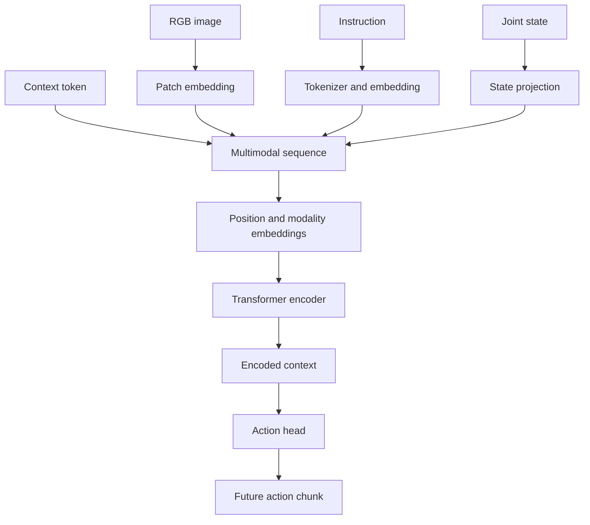

# SO-101 Policies and SmallVLA

This directory contains the scripted and learned policy stack for the SO-101
robotics playground. It covers deterministic motion baselines, LeRobot dataset
adaptation, a custom multimodal transformer, training, checkpoint evaluation,
and ROS 2 inference.

The current learned policy is a compact research baseline. It is best described
as a small vision-language-action transformer trained through offline behavior
cloning. It is not a pretrained, general-purpose VLA foundation model.

## Package structure

```text
policies/
├── setup.py
├── tests/
└── so101_policies/
    ├── common/
    ├── config/
    ├── data/
    ├── evaluation/
    ├── inference/
    ├── models/
    │   ├── action/
    │   ├── language/
    │   ├── primitives/
    │   ├── transformer/
    │   ├── vision/
    │   └── vla/
    ├── scripted/
    ├── training/
    ├── constants.py
    └── __init__.py
```

At a high level:

```text
LeRobot dataset
      ↓
Data adaptation and normalization
      ↓
SmallVLA training
      ↓
Checkpoint and offline evaluation
      ↓
ROS 2 inference
      ↓
C++ safety controller
      ↓
Isaac Sim or physical robot
```

## `common/`

The `common` package contains utilities shared by multiple policies.

### `trajectory.py`

This module generates intermediate joint targets between a starting pose and a
goal pose. Rather than commanding a large instantaneous change, it produces a
sequence of smaller targets.

For starting configuration \(q_0\), target configuration \(q_1\), and progress
value \(\alpha(t)\in[0,1]\):

\[
q(t)=(1-\alpha(t))q_0+\alpha(t)q_1
\]

This is deterministic trajectory interpolation used by scripted policies. It
is separate from the learned action chunks predicted by `SmallVLA`.

### `__init__.py`

Marks the directory as a Python package and may expose selected utilities
through shorter import paths.

## `config/`

Configuration files hold values that should be editable without modifying
policy logic.

### `poses.yaml`

Stores named joint configurations and timing parameters used by scripted
policies. Typical entries represent home, approach, grasp, transport, and
placement poses.

Separating pose values from Python code makes tuning easier and keeps policy
logic independent of a particular set of joint targets.

## `data/`

The data package converts external demonstrations into the exact tensor format
expected by the model.

### `dataset_factory.py`

This is the main dataset-construction entry point. It:

1. Loads `LeRobotDataset` from a repository or local root.
2. Defines future action timestamps for action chunks.
3. Selects the video-decoding backend.
4. Creates the instruction tokenizer.
5. Wraps the external dataset with `LeRobotAdapter`.

For action-chunk length \(K\) and dataset frequency \(f\), future actions are
requested at:

\[
0,\frac{1}{f},\frac{2}{f},\ldots,\frac{K-1}{f}
\]

### `lerobot_adapter.py`

This adapter converts one LeRobot sample into the internal representation:

```python
{
    "image": image,
    "token_ids": token_ids,
    "text_attention_mask": text_mask,
    "robot_state": state,
    "actions": actions,
    "action_mask": action_mask,
}
```

Its responsibilities include:

- Converting images into channel-first tensors
- Selecting RGB channels
- Scaling pixels to `[0, 1]`
- Resizing images to the configured resolution
- Reading `observation.state` and `action`
- Converting degrees to radians
- Applying per-joint signs and offsets
- Validating action-chunk shape
- Generating action-padding masks
- Tokenizing the task instruction

Joint adaptation is approximately:

\[q_{internal}=q_{dataset}\frac{\pi}{180}\odot sign+offset\]

The downloaded dataset reports `robot_type: so100_follower`. Matching the
six-dimensional tensor shape does not establish physical compatibility with
the SO-101. Joint order, signs, offsets, limits, gripper mapping, and geometry
must be validated explicitly.

### `statistics.py`

Computes training-set statistics:

- State mean
- State standard deviation
- Action mean
- Action standard deviation

Statistics should be calculated from the training subset only. Including
validation data would leak information into the training process.

### `normalization.py`

`FeatureNormalizer` applies the training statistics:

\[
\tilde{s}=\frac{s-\mu_s}{\sigma_s}
\]

\[
\tilde{a}=\frac{a-\mu_a}{\sigma_a}
\]

Predictions are returned to robot units with:

\[
a=\tilde{a}\sigma_a+\mu_a
\]

The statistics are registered as PyTorch buffers. They move with the module to
CPU or CUDA but are not trainable parameters.

## `evaluation/`

### `evaluate_checkpoint.py`

This script evaluates a trained checkpoint without updating its parameters.
It reconstructs the validation subset, runs inference, and reports:

- Mean absolute error
- Mean squared error
- Maximum absolute error
- Per-joint errors

These are open-loop dataset metrics. They measure similarity to recorded
actions, not closed-loop manipulation success.

An important future improvement is episode-level validation splitting. A
random frame-level split can place temporally adjacent frames from one episode
in both training and validation, producing an overly optimistic estimate of
generalization.

## `inference/`

The inference package connects a trained checkpoint to ROS 2.

### `checkpoint_loader.py`

Reconstructs the complete learned policy from a checkpoint. It loads:

- Model configuration
- Learned model parameters
- Tokenizer vocabulary
- State and action normalization statistics
- Training epoch
- Recorded metrics

It creates `SmallVLA`, moves it to the selected device, restores its weights,
and enables evaluation mode.

### `ros_image.py`

Converts `sensor_msgs/msg/Image` into a PyTorch image tensor. It must interpret
the ROS encoding, dimensions, row stride, byte layout, and channel order
correctly.

An RGB/BGR mistake is especially important for visually distinctive objects:
a red cube can be presented to the model as blue if channels are reversed.

### `policy_node.py`

The live ROS 2 policy process subscribes to:

```text
/so101/camera/rgb
/so101/joint_states
```

and publishes:

```text
/so101/policy_action
```

Its control path is:

```text
Latest image and joint state
        ↓
Observation validation
        ↓
Tokenization and normalization
        ↓
SmallVLA inference
        ↓
Action denormalization
        ↓
Policy-side bounds
        ↓
sensor_msgs/msg/JointState
        ↓
C++ safety controller
```

Before further closed-loop testing, this node should include:

- `publish_actions: false` by default
- Explicit operator enable
- Fresh-image and fresh-state requirements
- Maximum displacement from measured position
- Single-action and single-chunk test modes
- Automatic disable after a controlled test

The policy output must be treated as untrusted even when its tensor dimensions
and numerical values are valid.

## `models/`

The models package contains the custom neural-network implementation.

```text
models/
├── action/
├── language/
├── primitives/
├── transformer/
├── vision/
└── vla/
```

## SmallVLA input and output

The policy approximates:

\[
\pi_\theta(A_t\mid I_t,L,S_t)
\]

where:

- \(I_t\) is the current RGB image.
- \(L\) is the language instruction.
- \(S_t\) is the current robot state.
- \(A_t\) is a chunk of future joint actions.
- \(\theta\) represents the learned parameters.

| Signal | Shape | Meaning |
|---|---|---|
| Image | `[B, C, H, W]` | Current RGB observation |
| Token IDs | `[B, T]` | Encoded instruction |
| Text mask | `[B, T]` | Valid text positions |
| Robot state | `[B, S]` | Current joint state |
| Action chunk | `[B, K, A]` | Future joint-position targets |

For the current interface, `S = 6` and `A = 6`.

## Multimodal architecture



The transformer sequence is:

```text
[context] [image patches...] [text tokens...] [robot state]
```

All token types are projected into the same model dimension.

## `models/primitives/`

This package implements fundamental neural-network operations.

### `linear.py`

Implements an affine transformation:

\[
y=xW^T+b
\]

Linear transformations are used for state projection, attention projections,
feed-forward networks, and action decoding.

### `embedding.py`

Maps integer token IDs to learned vectors:

\[
e_i=E[token_i]
\]

### `layer_norm.py`

Normalizes each token across its feature dimension, stabilizing transformer
optimization.

### `activation.py`

Implements GELU:

\[
GELU(x)=x\Phi(x)
\]

### `dropout.py`

Randomly removes activations during training to reduce overfitting. Dropout is
disabled when the model is in evaluation mode.

### `positional_embedding.py`

Provides learned vectors that identify token positions in the multimodal
sequence.

## `models/vision/`

### `patch_embedding.py`

Divides the image into non-overlapping square patches. For patch size \(P\),
the number of patches is:

\[
N=\frac{H}{P}\frac{W}{P}
\]

Each flattened patch is projected into the transformer model dimension. This
encoder is trained from scratch rather than initialized from a pretrained
vision model, making it lightweight but sensitive to visual domain shift.

## `models/language/`

### `tokenizer.py`

`VocabularyTokenizer` builds a small vocabulary from the training instructions,
converts text into token IDs, pads sequences, and creates a text mask.

The current dataset uses essentially one instruction: `pick and place the
object`. Language is architecturally present, but varied language grounding has
not yet been demonstrated. Multiple tasks and instructions are required to
measure whether language meaningfully changes behavior.

## `models/transformer/`

### `attention.py`

Implements multi-head self-attention. Each token produces query, key, and value
vectors:

\[
Q=XW_Q,\qquad K=XW_K,\qquad V=XW_V
\]

Attention is:

\[Attention(Q,K,V)=softmax\left(\frac{QK^T}{\sqrt{d_h}}\right)V\]

The query asks what a token needs, the key describes what another token
contains, and the value contains the information that can be transferred.

In principle, attention allows the context token to combine object-relevant
image patches, language, and robot state. It makes such interaction possible;
it does not prove that meaningful visual or language grounding was learned.

### `feed_forward.py`

Applies a nonlinear transformation independently to every token:

\[
FFN(x)=W_2GELU(W_1x+b_1)+b_2
\]

### `block.py`

Combines layer normalization, self-attention, residual connections, dropout,
and a feed-forward network.

### `encoder.py`

Stacks several transformer blocks. After encoding, `SmallVLA` selects the
first token as the fused representation:

```python
context = encoded_tokens[:, 0]
```

## `models/action/`

### `action_head.py`

Maps the fused context vector into `action_chunk_length × action_dimension`
values, then reshapes them into:

```text
[batch, action_chunk_length, action_dimension]
```

The complete chunk is predicted in parallel rather than autoregressively.

Action chunks represent short-horizon motion and reduce inference frequency,
but executing too much of a chunk open-loop can amplify error. Initial testing
should execute one bounded action before observing and replanning.

## `models/vla/`

### `configuration.py`

Defines and validates model structure:

- Image dimensions and channels
- Patch size
- Vocabulary size
- Maximum text length
- State and action dimensions
- Action chunk length
- Model dimension
- Number of attention heads
- Feed-forward dimension
- Number of transformer layers
- Dropout probability
- Maximum sequence length

### `model.py`

`SmallVLA` performs the complete forward pass:

1. Validate input shapes.
2. Expand the learned context token.
3. Convert the image into patch tokens.
4. Embed language-token IDs.
5. Project the robot state into one token.
6. Add modality embeddings.
7. Concatenate the multimodal sequence.
8. Construct the attention mask.
9. Add learned positional embeddings.
10. Apply input dropout.
11. Run the transformer encoder.
12. Select the encoded context token.
13. Predict the action chunk.

The four modality identifiers are context, image, text, and robot state.

## `scripted/`

Scripted policies are deterministic baselines and debugging tools.

### `joint_test_policy.py`

Moves one joint at a time through conservative targets to verify joint order,
signs, limits, and the ROS command path.

### `pose_sequence_policy.py`

Moves through named poses using configuration from `poses.yaml` and trajectory
interpolation.

### `pose_tuning_policy.py`

Supports manual adjustment of useful configurations such as home, approach,
grasp, transport, and placement poses.

A scripted expert should complete a task reliably before its demonstrations
are used to train a learned policy.

## `training/`

### `configuration.py`

Defines how training is performed: dataset location, camera key, instruction,
frequency, batch size, epoch count, learning rate, weight decay, gradient
clipping, worker count, random seed, and checkpoint directory.

`VLAConfiguration` defines what the network is. `TrainingConfiguration` defines
how it is optimized.

### `losses.py`

Implements masked mean-squared action error:

\[\mathcal{L}=\frac{\sum M(\hat{A}-A)^2}{\sum M}\]

The mask prevents padded action steps from contributing to the loss.

### `checkpoint.py`

Saves model parameters, configuration, vocabulary, normalization statistics,
epoch, and metrics. `last.pt` is the latest epoch; `best.pt` is selected by
validation performance.

### `train.py`

Orchestrates dataset loading, splitting, statistics, model creation,
optimization, validation, and checkpointing.

For each training batch it:

1. Moves tensors to the selected device.
2. Normalizes states and target actions.
3. Runs the model.
4. Computes masked loss.
5. Performs backpropagation.
6. Clips gradients.
7. Updates parameters.

## `constants.py`

Stores Python-side robot constants such as joint names, ordering, limits, and
shared topic or timing values. These definitions must remain consistent with
the C++ controller constants.

A future improvement is to generate Python and C++ robot constants from one
authoritative description.

## CUDA execution

The project implements neural-network architecture and training logic in
Python using PyTorch. It does not currently implement custom CUDA kernels.

When the model and tensors are moved to a CUDA device:

```python
device = torch.device(
    "cuda" if torch.cuda.is_available() else "cpu"
)

model = model.to(device)
images = images.to(device)
robot_states = robot_states.to(device)
```

PyTorch dispatches tensor operations to its compiled CUDA backend and optimized
NVIDIA libraries. Matrix multiplication, attention, normalization, activation,
backpropagation, and optimizer computations therefore run on the GPU.

The division of responsibility is:

| Layer | Responsibility |
|---|---|
| VLA architecture | This repository |
| Attention and transformer logic | This repository |
| Multimodal fusion and action decoding | This repository |
| Training and inference orchestration | This repository |
| Tensor implementation | PyTorch |
| Automatic differentiation | PyTorch |
| CUDA dispatch and optimized kernels | PyTorch and NVIDIA libraries |

The accurate description is:

> A custom PyTorch VLA architecture using PyTorch-managed CUDA acceleration.

It should not be described as a custom CUDA-kernel implementation.

Confirm runtime placement with:

```python
print(next(model.parameters()).device)
```

and monitor GPU activity with:

```bash
watch -n 0.5 nvidia-smi
```

## Current experimental result

The initial model was trained for ten epochs on a downloaded LeRobot dataset:

```text
Robot type:     SO-100 follower
Episodes:       50
Frames:         11,939
Task:           Pick and place
```

Held-out evaluation:

| Metric | Result |
|---|---:|
| Validation samples | 1,193 |
| Mean absolute error | 0.053084 rad |
| Mean absolute error | 3.042 degrees |
| Mean squared error | 0.007896 |
| Maximum error | 1.274848 rad |
| Maximum error | 73.043 degrees |

The model learned statistical structure from the dataset and produces
pick-and-place-like actions during simulation. It does not currently grasp the
simulated cube reliably.

## Why the simulation task fails

The checkpoint was trained on SO-100 demonstrations but deployed in an SO-101
Isaac Sim environment. Differences include robot calibration, joint mapping,
camera viewpoint, object appearance, scene geometry, starting pose, and the
states produced after the policy's own errors.

This is distribution shift:

\[p_{training}(I,S,A)\neq p_{deployment}(I,S,A)\]

Offline action accuracy does not directly imply closed-loop task success. Once
one prediction moves the robot into an unfamiliar state, subsequent errors can
compound.

## What has been demonstrated

- The custom neural-network implementation trains.
- Gradients propagate through the full model.
- Checkpoints save and restore correctly.
- Offline evaluation works.
- CUDA inference works.
- ROS images and joint states reach the policy.
- The VLA produces structured action chunks.
- The C++ command pipeline receives learned actions.
- The model produces behavior resembling its demonstrations.

The experiment has not yet demonstrated:

- Reliable localization of the simulated cube
- Language-conditioned task variation
- Validated SO-100-to-SO-101 transfer
- Stable continuous VLA control
- Successful closed-loop pick and place
- Safe physical deployment

## Next experiments

1. Disable action publishing by default.
2. Log predictions without robot motion.
3. Compare predictions with the cube present, moved, and removed.
4. Validate joint units, signs, offsets, limits, and gripper mapping.
5. Execute one bounded action at a time.
6. Implement a scripted or IK-based simulation expert.
7. Record successful SO-101 demonstrations in LeRobot format.
8. Fine-tune the SO-100 checkpoint on matched simulation data.
9. Train a second SO-101 model from scratch as a baseline.
10. Compare offline error and closed-loop task-success rate.

A useful research question is:

> How effectively can a small VLA trained on SO-100 demonstrations adapt to an
> SO-101 simulation using limited task-specific fine-tuning data?

## Installation and tests

Install in editable mode from the project root:

```bash
python3 -m pip install --user -e ./policies
```

Run the policy tests:

```bash
python3 -m unittest discover \
  -s policies/tests \
  -t policies
```

Evaluate a checkpoint:

```bash
python3 -m so101_policies.evaluation.evaluate_checkpoint \
  --checkpoint models/checkpoints/small_vla/best.pt \
  --dataset-root datasets/raw/svla_so101_pickplace
```

## Summary

The policy package provides a complete experimental path from demonstrations to
robot actions: dataset adaptation, normalization, a custom multimodal
transformer, behavior-cloning training, checkpoint evaluation, CUDA inference,
ROS 2 integration, and deterministic scripted baselines.

The software pipeline is operational. The next research stage is to establish
safe inference, collect matched SO-101 simulation demonstrations, and compare
fine-tuning against training from scratch using closed-loop task success.