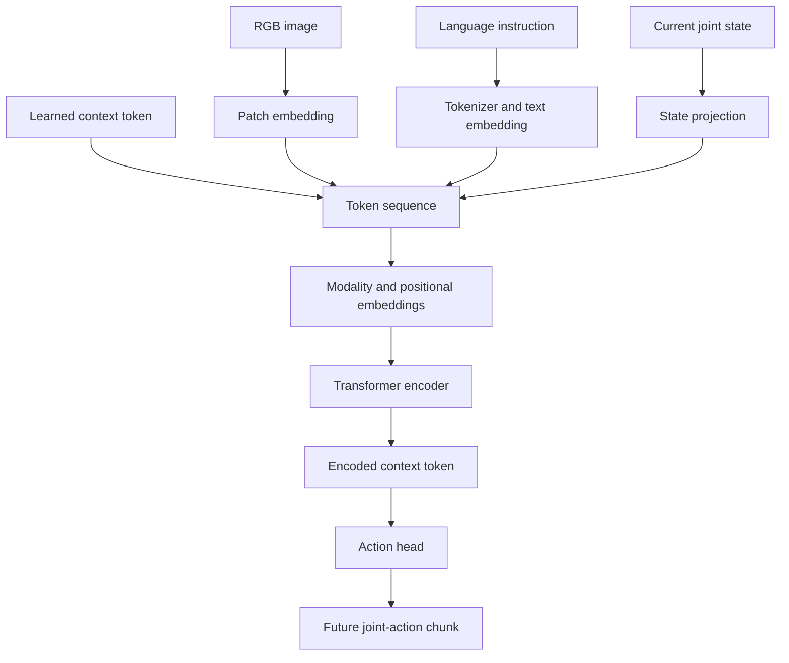
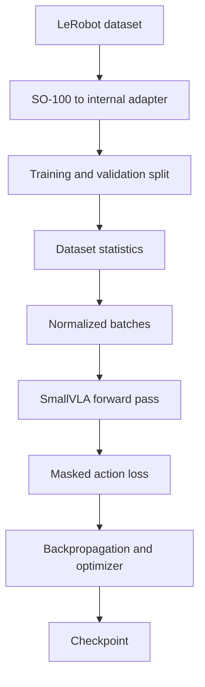
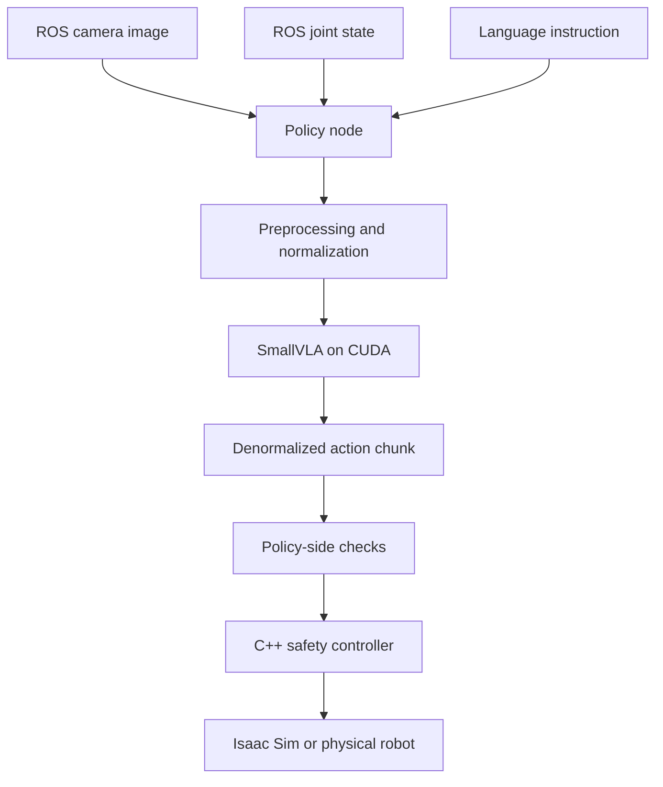

# SmallVLA Architecture

`SmallVLA` is a compact vision-language-action policy implemented for the
SO-101 research pipeline.

It combines:

- One RGB image
- One language instruction
- The current robot joint state
- A custom transformer encoder
- A joint-action chunk prediction head

The model is intentionally small enough to train and run locally. It is a
research baseline for studying multimodal robot-policy implementation rather
than a pretrained, general-purpose robotics foundation model.

## Research objective

The policy approximates:

\[
\pi_\theta(A_t \mid I_t, L, S_t)
\]

where:

- \(I_t\) is the current RGB observation.
- \(L\) is the language instruction.
- \(S_t\) is the current robot state.
- \(A_t\) is a chunk of future robot actions.
- \(\theta\) represents the learned model parameters.

For the current implementation:

```text
RGB image + instruction + current joint state
                        ↓
                    SmallVLA
                        ↓
         future joint-position action chunk
```

The model is trained through offline behavior cloning. It learns to imitate
actions recorded in demonstrations.

## Important classification

This project uses the term VLA because the policy combines vision, language,
and robot actions in one learned model.

However, the current implementation is more precisely described as a:

> Small multimodal action-chunking transformer trained through behavior
> cloning.

It is not yet comparable to a large pretrained VLA foundation model. In
particular, it does not currently include:

- A pretrained visual encoder
- A pretrained language model
- Internet-scale vision-language pretraining
- Multiple robot embodiments
- Broad language grounding
- A diffusion or autoregressive action decoder
- General-purpose object detection
- Explicit geometric planning
- Built-in collision avoidance

This distinction is important when interpreting its behavior and research
results.

## Architecture overview



The transformer receives all modalities as one token sequence. Self-attention
allows each token to exchange information with every valid token from the
other modalities.

## Inputs and outputs

| Signal | Symbol | Typical shape | Meaning |
|---|---|---|---|
| Images | \(I_t\) | `[B, C, H, W]` | Current RGB observation |
| Token IDs | \(T\) | `[B, L]` | Tokenized language |
| Text mask | \(M\) | `[B, L]` | Valid text-token mask |
| Robot state | \(S_t\) | `[B, D_s]` | Current joint state |
| Predicted actions | \(\hat{A}_t\) | `[B, K, D_a]` | Future action chunk |

Definitions:

- `B`: batch size
- `C`: number of image channels
- `H`, `W`: image height and width
- `L`: maximum text length
- `D_s`: state dimension
- `D_a`: action dimension
- `K`: action chunk length

For the SO-101 pipeline, the state and action dimensions are six:

```text
shoulder_pan
shoulder_lift
elbow_flex
wrist_flex
wrist_roll
gripper
```

## 1. Image preprocessing

Dataset images are converted into channel-first tensors:

```text
[height, width, channels]
            ↓
[channels, height, width]
```

Images are resized to the dimensions specified in `VLAConfiguration` and
converted to floating-point values in the range:

\[
[0,255] \rightarrow [0,1]
\]

The current preprocessing does not perform advanced augmentation or use a
pretrained normalization scheme such as ImageNet statistics.

Implementation:

```text
data/lerobot_adapter.py
inference/ros_image.py
data/normalization.py
```

## 2. Vision patch embedding

The image is divided into fixed-size non-overlapping patches.

For patch size \(P\), image height \(H\), and image width \(W\), the number of
image tokens is:

\[
N_{\text{image}} =
\frac{H}{P}
\frac{W}{P}
\]

Each patch contains:

\[
P \times P \times C
\]

values. The patch is projected into the transformer model dimension \(D\).

```text
RGB image
    ↓
non-overlapping patches
    ↓
flattened patch vectors
    ↓
linear projection
    ↓
image tokens [B, N_image, D]
```

Implementation:

```text
models/vision/patch_embedding.py
```

Unlike a pretrained CNN or vision transformer, this patch encoder learns visual
features entirely from the robotics training dataset.

## 3. Language tokenization

The language instruction is converted into integer token IDs by
`VocabularyTokenizer`.

```text
"pick and place the object"
                ↓
       vocabulary lookup
                ↓
        integer token IDs
```

Token IDs are passed through a learned embedding table:

\[
E_{\text{text}}(T) \in \mathbb{R}^{B \times L \times D}
\]

Padding tokens are identified by the text attention mask and are excluded from
attention.

Implementation:

```text
models/language/tokenizer.py
models/primitives/embedding.py
```

The current dataset uses essentially one instruction. Consequently, language
provides little discriminative information during training. The model cannot
yet be assumed to understand varied natural-language instructions.

Meaningful language grounding requires demonstrations containing multiple
instructions whose wording corresponds to different observable behaviors.

## 4. Robot-state embedding

The current robot state is a six-dimensional joint vector:

\[
S_t \in \mathbb{R}^{B \times D_s}
\]

A learned linear projection converts it into one transformer token:

\[
E_{\text{state}} =
S_tW_s+b_s
\]

The result is expanded to:

```text
[B, 1, D]
```

Implementation:

```text
models/primitives/linear.py
models/vla/model.py
```

The current model uses the present joint state rather than a full state
history. Temporal information enters primarily through the predicted action
chunk and correlations learned from individual demonstration frames.

## 5. Learned context token

The model includes a learned context token:

\[
x_{\text{context}} \in \mathbb{R}^{1 \times 1 \times D}
\]

It is expanded across the batch and placed at the beginning of the sequence.

Its role is similar to a classification token in a vision transformer. After
self-attention, it contains an aggregated representation of the image,
language, and robot state.

The action head reads this encoded context token to generate robot actions.

Implementation:

```text
models/vla/model.py
```

## 6. Modality embeddings

Image, language, state, and context tokens originate from different sources.
The model adds a learned modality vector to each token so the transformer can
distinguish their roles.

The four modalities are:

```text
0: context
1: image
2: text
3: robot state
```

For a token \(x_i\) belonging to modality \(m\):

\[
x_i' = x_i + e_m
\]

where \(e_m\) is the learned modality embedding.

Without these embeddings, an image-patch token and language token would occupy
the same representation space without an explicit identifier for their source.

## 7. Sequence construction

The complete transformer input is:

```text
[context] [image patches] [text tokens] [state]
```

Symbolically:

\[
X =
[X_{\text{context}};
 X_{\text{image}};
 X_{\text{text}};
 X_{\text{state}}]
\]

Its total sequence length is:

\[
N =
1 + N_{\text{image}} + L + 1
\]

The sequence must not exceed `maximum_sequence_length` in
`VLAConfiguration`.

## 8. Positional embeddings

Self-attention does not inherently know token order. A learned positional
embedding is added to every token:

\[
X' = X + E_{\text{position}}
\]

This identifies each token’s location in the multimodal sequence.

Implementation:

```text
models/primitives/positional_embedding.py
```

The positional embedding describes sequence position, while modality embeddings
describe token origin. Both are required for the fused representation.

## 9. Attention mask

The model builds one Boolean attention mask containing:

- A valid context token
- All image tokens
- Valid language tokens
- A valid robot-state token

Padding language tokens are marked invalid.

```text
context mask + image mask + text mask + state mask
```

The mask prevents padded text positions from influencing the encoded
representation.

## 10. Multi-head self-attention

For an input token matrix \(X\), the attention layer produces queries, keys,
and values:

\[
Q=XW_Q,\qquad K=XW_K,\qquad V=XW_V
\]

Scaled dot-product attention is:

\[
\operatorname{Attention}(Q,K,V)
=
\operatorname{softmax}
\left(
\frac{QK^\top}{\sqrt{d_h}}
\right)V
\]

where \(d_h\) is the dimension of one attention head.

Multiple heads learn different relationships simultaneously:

\[
\operatorname{MultiHead}(X)
=
\operatorname{Concat}
(\text{head}_1,\ldots,\text{head}_h)W_O
\]

In this model, attention can associate:

- Image regions with language tokens
- Image regions with the current joint configuration
- Robot state with likely future actions
- The context token with information from every modality

Implementation:

```text
models/transformer/attention.py
```

The implementation owns the query, key, value, masking, head reshaping,
attention-weight, and output-projection logic rather than using
`torch.nn.MultiheadAttention`.

## 11. Transformer feed-forward network

Each transformer block contains a position-wise feed-forward network:

\[
\operatorname{FFN}(x)
=
W_2\,\operatorname{GELU}(W_1x+b_1)+b_2
\]

The first linear layer expands the representation to the configured
feed-forward dimension. The second projects it back to the model dimension.

Implementation:

```text
models/transformer/feed_forward.py
models/primitives/activation.py
```

GELU provides a smooth nonlinear transformation:

\[
\operatorname{GELU}(x)
=
x\Phi(x)
\]

where \(\Phi(x)\) is the standard normal cumulative distribution function.

## 12. Transformer block

Each encoder block combines:

- Layer normalization
- Multi-head self-attention
- Residual connection
- Feed-forward network
- Dropout
- Second residual connection

Conceptually:

```text
x
├── layer normalization
├── self-attention
├── dropout
└── residual addition
        ↓
y
├── layer normalization
├── feed-forward network
├── dropout
└── residual addition
        ↓
output
```

Residual connections preserve information and improve gradient flow through
multiple layers.

Implementation:

```text
models/transformer/block.py
models/primitives/layer_norm.py
models/primitives/dropout.py
```

## 13. Transformer encoder

The transformer encoder applies multiple blocks sequentially:

\[
X^{(l+1)}
=
\operatorname{Block}^{(l)}(X^{(l)})
\]

After the final block, the first token is selected:

```python
context = encoded_tokens[:, 0]
```

This produces:

```text
[B, D]
```

The context vector is expected to summarize the complete observation and
instruction.

Implementation:

```text
models/transformer/encoder.py
models/vla/model.py
```

## 14. Action head

The action head maps the encoded context vector into a complete future action
chunk.

Input:

```text
[B, D]
```

Output before reshaping:

```text
[B, K × D_a]
```

Final output:

```text
[B, K, D_a]
```

Each action step contains the six commanded joint positions.

Implementation:

```text
models/action/action_head.py
```

The model predicts the entire chunk in parallel. It is not an autoregressive
decoder and does not generate one action token at a time.

## Why action chunks are used

Predicting several future actions at once can:

- Represent short-term motion structure
- Reduce inference frequency
- Smooth behavior relative to independent one-step predictions
- Allow inference to run asynchronously from the low-level control loop

However, long chunks may become inaccurate after the robot deviates from the
demonstrated trajectory. A robust deployment system should replan frequently
and carefully decide how many predicted actions to execute before observing
again.

## Data normalization

Robot states and actions are normalized using statistics computed from the
training dataset:

\[
\tilde{s}
=
\frac{s-\mu_s}{\sigma_s}
\]

\[
\tilde{a}
=
\frac{a-\mu_a}{\sigma_a}
\]

The model operates in normalized space. Predictions are converted back into
robot units using:

\[
\hat{a}
=
\tilde{a}\sigma_a+\mu_a
\]

Implementation:

```text
data/statistics.py
data/normalization.py
```

Normalization statistics are stored in the checkpoint. Inference must use the
same statistics used during training.

Incorrect units, signs, offsets, or normalization values can produce
numerically valid but physically incorrect actions.

## SO-100 dataset adaptation

The downloaded dataset reports:

```text
robot_type: so100_follower
```

The adapter converts recorded values from degrees to radians and can apply
joint signs and offsets:

\[
q_{\text{adapted}}
=
(q_{\text{dataset}} \cdot \text{unit scale})
\odot \text{joint signs}
+
\text{joint offsets}
\]

Implementation:

```text
data/lerobot_adapter.py
```

The dataset and SO-101 simulation both expose six values, so their tensor
shapes are compatible. Shape compatibility does not establish physical
compatibility.

Transfer still requires validation of:

- Joint order
- Joint signs
- Zero offsets
- Position ranges
- Gripper mapping
- Link geometry
- Robot starting pose
- Camera-to-robot transform

## Training objective

The model is trained through behavior cloning with a masked mean-squared action
error.

For valid action elements:

\[
\mathcal{L}
=
\frac{
\sum_{b,k,j}
M_{b,k}
\left(
\hat{A}_{b,k,j}-A_{b,k,j}
\right)^2
}{
D_a \sum_{b,k}M_{b,k}
}
\]

where:

- \(\hat{A}\) is the predicted normalized action chunk.
- \(A\) is the recorded normalized action chunk.
- \(M\) marks valid, non-padded action steps.

Implementation:

```text
training/losses.py
training/train.py
```

The objective asks:

> Given an observation sampled from the demonstration dataset, can the model
> reproduce the demonstrator’s future joint commands?

It does not directly optimize:

- Task success
- Grasp quality
- Collision avoidance
- Closed-loop stability
- Recovery from mistakes

Those properties require evaluation beyond the supervised training loss.

## Training pipeline



The current training workflow:

1. Loads the LeRobot dataset.
2. Requests future actions using `delta_timestamps`.
3. Converts images, states, and actions into the internal format.
4. Splits samples into training and validation subsets.
5. Computes normalization statistics from training data.
6. Trains the model with gradient descent.
7. Evaluates held-out validation loss.
8. Saves `last.pt`.
9. Saves `best.pt` when validation improves.

## Checkpoint contents

The checkpoint contains the learned and preprocessing state required for
inference:

- Training epoch
- Model parameters
- Model configuration
- Tokenizer vocabulary
- State normalization statistics
- Action normalization statistics
- Training and validation metrics

Implementation:

```text
training/checkpoint.py
inference/checkpoint_loader.py
```

The checkpoint does not contain:

- Training videos
- The complete dataset
- ROS 2
- Isaac Sim
- Collision avoidance
- A controller
- A world model
- General manipulation knowledge

## Inference pipeline



During inference:

1. The policy receives an RGB image.
2. It receives the current robot joint state.
3. It tokenizes the configured instruction.
4. It normalizes the robot state.
5. It runs `SmallVLA` under inference mode.
6. It denormalizes the predicted action chunk.
7. It publishes joint targets through ROS 2.
8. The C++ controller validates and forwards commands.

Implementation:

```text
inference/policy_node.py
inference/checkpoint_loader.py
inference/ros_image.py
```

## Current experimental result

The 10-epoch checkpoint achieved:

| Metric | Result |
|---|---:|
| Validation samples | 1,193 |
| Mean absolute error | 0.053084 rad |
| Mean absolute error | 3.042 degrees |
| Mean squared error | 0.007896 |
| Maximum error | 1.274848 rad |
| Maximum error | 73.043 degrees |

The mean error indicates that the model learned meaningful correlations within
the downloaded dataset. The large maximum error indicates that important
failure cases remain.

These are open-loop dataset metrics. They do not demonstrate successful
closed-loop manipulation.

## Why the current simulation does not complete the task

The model was trained using an SO-100 dataset, then deployed in an SO-101 Isaac
Sim environment.

The current simulation differs in:

- Robot calibration
- Camera viewpoint
- Robot appearance
- Table geometry
- Object appearance and placement
- Lighting and background
- Starting pose
- Closed-loop state distribution

The model therefore produces recognizable pick-like behavior without
necessarily aligning its gripper with the simulated cube.

This is a domain-shift problem:

\[
p_{\text{training}}(I,S,A)
\neq
p_{\text{simulation}}(I,S,A)
\]

Once the model makes an incorrect move, the next observation may be unlike
anything present in the demonstrations. Subsequent errors can compound.

## What the current model has demonstrated

The experiment has validated that:

- The custom neural-network implementation trains.
- Gradients propagate through the complete architecture.
- The checkpoint can be restored.
- Offline evaluation works.
- CUDA inference works.
- ROS camera and joint-state inputs reach the policy.
- The VLA produces structured action chunks.
- Actions reach the C++ command path.
- The model generates behavior resembling its demonstrations.

The experiment has not yet demonstrated that:

- The model localizes the simulated cube.
- Language changes robot behavior.
- The policy transfers from SO-100 to SO-101.
- The controller is stable under continuous VLA output.
- The model completes closed-loop pick-and-place.
- The system is safe for physical deployment.

## Required deployment safeguards

Learned policy output must be treated as untrusted.

Before further closed-loop experiments, the inference path should support:

- Action publishing disabled by default
- Explicit operator enable
- Fresh-image requirement
- Fresh-joint-state requirement
- Maximum per-joint displacement
- Maximum velocity and acceleration
- Single-action test mode
- Single-chunk test mode
- Automatic disable after one test
- Workspace and collision checks
- Immediate safe hold on timeout

The C++ safety controller remains necessary even when equivalent checks exist
in Python.

## Next research experiment

The next controlled experiment should determine whether the policy uses visual
object position.

Run inference without publishing actions under three conditions:

1. Cube in its original location
2. Cube moved to another reachable location
3. Cube removed from the scene

Record the first predicted action chunk for each condition.

If predictions remain nearly identical, the policy likely learned a largely
state-conditioned average trajectory. If predictions change consistently with
the cube position, the visual pathway is influencing the action meaningfully.

## Target-environment dataset

The long-term solution is to collect demonstrations directly from the SO-101
Isaac Sim environment.

Each recorded step should contain:

- RGB observation
- Current joint position
- Current joint velocity
- Commanded joint action
- Language instruction
- Episode index
- Frame timestamp
- Termination flag
- Task-success label

Demonstrations may be produced through:

- Scripted trajectories
- A scripted grasping expert
- SpaceMouse Cartesian control with inverse kinematics
- Physical leader-arm teleoperation

Training on matched simulation data changes the objective from cross-robot
transfer to learning the intended target environment.

## Relevant implementation files

| File | Responsibility |
|---|---|
| `configuration.py` | Model dimensions and architectural constraints |
| `model.py` | Multimodal token construction and forward pass |
| `../vision/patch_embedding.py` | Image-to-patch token conversion |
| `../language/tokenizer.py` | Instruction vocabulary and encoding |
| `../primitives/embedding.py` | Token embedding lookup |
| `../primitives/linear.py` | Learned affine projections |
| `../primitives/layer_norm.py` | Feature normalization within blocks |
| `../primitives/activation.py` | GELU activation |
| `../primitives/positional_embedding.py` | Learned sequence positions |
| `../transformer/attention.py` | Custom multi-head self-attention |
| `../transformer/feed_forward.py` | Transformer nonlinear projection |
| `../transformer/block.py` | Attention and feed-forward residual block |
| `../transformer/encoder.py` | Stacked transformer blocks |
| `../action/action_head.py` | Context-to-action-chunk decoding |
| `../../../data/lerobot_adapter.py` | Dataset conversion and calibration |
| `../../../data/normalization.py` | State and action normalization |
| `../../../training/train.py` | Optimization and validation loop |
| `../../../training/losses.py` | Masked behavior-cloning objective |
| `../../../inference/policy_node.py` | ROS 2 inference integration |

## Research directions

This baseline supports several future research questions:

1. How much visual variation is required for object-conditioned behavior?
2. Does action chunk length affect stability and task success?
3. How often should the system replan during chunk execution?
4. How well can SO-100 demonstrations transfer to SO-101?
5. Which calibration parameters dominate embodiment transfer?
6. Does state history improve motion understanding?
7. How much does language contribute when instructions vary?
8. Does pretrained vision improve sample efficiency?
9. Can simulation domain randomization improve real-world transfer?
10. How should uncertainty gate learned robot actions?

## Summary

`SmallVLA` is a complete, locally implemented multimodal transformer policy.
It converts image patches, language tokens, and a robot-state token into a
shared sequence, processes that sequence with custom transformer blocks, and
predicts a future joint-action chunk through behavior cloning.

The current checkpoint has learned behavior from an SO-100 pick-and-place
dataset. It demonstrates successful model training and end-to-end inference,
but it is not yet a validated SO-101 manipulation policy.

The next stage is safe inference analysis followed by collection of matched
SO-101 simulation demonstrations.